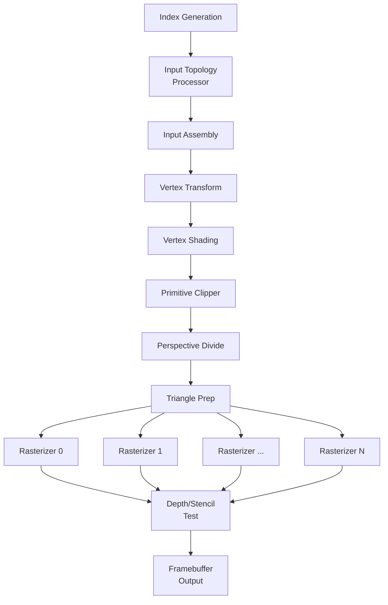

# Pixel-Forge architecture documentation

This document provides a detailed overview of the architecture and design of the Pixel-Forge graphics accelerator implemented on FPGA. It covers the major components, data flow, and key algorithms used in the rendering pipeline.

## 🚀 Overview
Pixel-Forge is a fixed-function graphics pipeline designed to implement a subset of the OpenGL ES 1.1 Common-Lite specification. It is built using Amaranth HDL and targets the Intel Cyclone V FPGA platform. The architecture is modular, allowing for easy understanding and potential future extensions.

It implements all of the major features of OpenGL ES 1.1 Common-Lite, including:
- Vertex transformations
- Lighting (ambient, diffuse)
- Triangle rasterization with perspective-correct interpolation
- Depth and stencil buffering
- Alpha blending
- Configurable topologies (Triangle List, Strip, Fan)

Major missing features are:
- Texturing
- Specular lighting
- Line and point rasterization (could be added by converting them to triangles)
- Multiple data layout support (for both vertex buffer and color and depthstencil formats)

## 🏗️ Pipeline Architecture

Components are connected via standardized interfaces (amaranth.lib.streaming) and separated with FIFOs to
help with critical path timing and handling stages with variable latency (like rasterizers, culling).

The vertex and primitive processing stages are on separate clock domain from the rasterization and fragment processing stages to allow for better timing closure and higher overall throughput.

## 🔍 Component Descriptions

### Index Generation
Generates vertex indices based on the configured index buffer format (U8, U16, U32 or NOT_INDEXED).

Implemented with a simple FSM that reads indices from memory and outputs them downstream.

Rendering start by sending a `start` signal to this module after configuring the index buffer address, count and format.

### Input Topology Processor
Processes the input primitive topology (Triangle List, Strip, Fan) and generates a stream of vertex
indices for the Input Assembly stage. It handles the conversion of different topologies into a consistent stream of triangles.

This module supports primitive restart index functionality and base vertex offset.

### Input Assembly
Fetches vertex attributes from the vertex buffer based on the incoming indices. It constructs complete vertex records
with all attributes (position, normal, color, etc.) for further processing.

For now it only supports a single vertex component format (Q13.13 saved as Q16.16 in memory).

The vertex buffers can be configured dynamically by setting the attribute base address and stride or
just using constant attributes.

This allows us for arbitrary vertex buffer layouts. (e.g AOS, SOA, and multiple independent buffers).

### Vertex Transform
Applies geometric transformations to vertex positions using the provided model-view and projection matrices. It performs matrix-vector multiplication in fixed-point arithmetic.

### Vertex Shading
Calculates per-vertex lighting using a simple lighting model (ambient + diffuse). It computes the final vertex color based on the light direction, normal, and material properties.

### Primitive Clipper
Clips primitives against the view frustum to ensure only visible geometry is processed further. It implements
the Sutherland-Hodgman clipping algorithm for triangles.

This stage has high variability in processing time depending on how many clip planes a triangle intersects.

The impact of this stage could be reduced by performing Guard-band clipping to avoid clipping most of the time.

### Perspective Divide
Performs perspective division on vertex positions to convert them from clip space to normalized device coordinates (NDC).

In this stage we change all parameters to smaller fixed-point formats, as we know that NDC ranges from -1.0 to 1.0.
As such from here on instead of using 27x27 bit DSP multipliers we can use smaller 18x18 bit multipliers, doubling
the effectiveness of DSP block usage.

### Triangle Prep
Prepares triangles for rasterization by computing edge equations, bounding boxes, and other necessary data for
the rasterizers.

Precomputes the inverse of the area of the triangle to optimize barycentric coordinate calculations during rasterization.
Also performs face culling based on the configured front-face and cull mode (using the sign of the computed area).

We also perform viewport transformation and scizzor testing here, so we don't rasterize pixels outside the viewport/scizzor rectangle.

### Rasterizer
A combination of pixel generator in the bounding box calculated in Triangle Prep and a set of fragment processors.

The main module creates a stream of pixels to be checked against the triangle using edge equations and
distributes them to multiple fragment processors for parallel processing.

Each fragment processor does the following:
- Computes edge functions
- Determines if the pixel is inside the triangle (all edge functions have the same sign)
- Computes linear barycentric coordinates (how much each vertex contributes to this pixel as if the triangle was flat)
- Performs linear interpolation of depth (as specified in OpenGL ES 1.1)
- Computes perspective-correct barycentric coordinates:
    - This is done by multiplying each linear barycentric coordinate by the reciprocal of the depth at that pixel
    - Normalizing the resulting values so they sum to 1.0
    - We effectively need to perform division in all pixels, that is why we created multiple fragment processors to parallelize this operation
- Performs perspective-correct interpolation of attributes (color, texture coords, etc.) using aforementioned perspective-correct barycentric coordinates

The main module then collects the output fragments from all fragment processors and forwards them downstream. This also
makes sure that fragments are output in the correct order, so OpenGL ES semantics are preserved (all fragments of a triangle are processed before moving to the next triangle).

### Depth/Stencil Test
For each incoming fragment, fetches current depth/stencil values from the attached buffers and performs depth and stencil tests based on the configured operations.

It also updates the depth/stencil buffer if value changed.

### Framebuffer Output
Performs blending operations and writes the final fragment color values to the color buffer.

It supports configurable blending modes and factors as specified in OpenGL ES 1.1.

It also uses Q0.9 fixed-point format for color components, as this is sufficient for color representation,
uses 9x9 bit multipliers further saving DSP resources on the FPGA.

## ⚙️ Configuration and Control
The Pixel-Forge GPU is configured and controlled via a set of Control and Status Registers (CSRs) accessible through a Wishbone bus interface. These registers allow the host CPU to set up the rendering state, issue draw calls, and monitor the GPU status.

The main configuration parameters include:
- Index buffer address, count, and format
- Vertex buffer base address, attribute offsets, and stride
- Input topology type and primitive restart index
- Viewport and scizzor rectangle parameters
- Depth and stencil test settings
- Blending modes and factors
- Transformation matrices (model-view, projection, normal-model-view (inverse transpose of model-view))
- Lighting parameters (light direction, colors)

The module also exposes which stages are currently busy,
allowing the host to wait for specific stages to complete before issuing new draw calls.
This prevents data hazards as well as allows for waiting for example only of the input assembly and vertex processing to
complete, as after that we can start the next draw call as long as we don't need to change clip/raster settings.

So we can with increasing speed:
- Wait for the whole pipeline to finish -> waiting to swap the framebuffers
- Wait for triangle preparation to finish -> Changing viewport/scizzor settings safely.
- Wait for vertex processing to finish -> changing matrices and lighting settings safely.
- Wait for input assembly to finish -> changing vertex buffer/index buffer/topology safely.

## 📚 Further Reading
For more detailed information on specific components, algorithms, and implementation details, please refer to the source code and comments within the `gpu/` directory. The unit and integration tests in the `tests/` directory also provide practical examples of how each module operates and interacts with others in the pipeline.

## Usage
Please see [software/DEMOS.md](software/DEMOS.md) for detailed instructions on running the demo applications and utilizing debugging utilities.

It also exposes some headers for using the GPU from C applications, located in `software/include/` and `libpixelforge.a` static library for easier integration.
