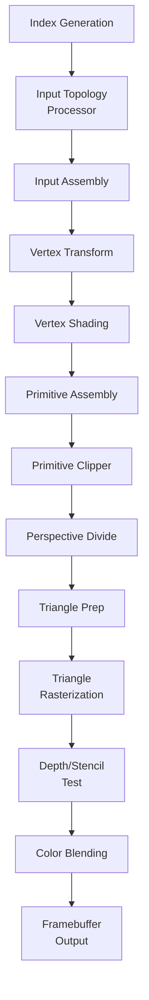

# PixelForge

**Fixed-pipeline graphics accelerator based on FPGA**

A hardware implementation of a subset of [OpenGL ES 1.1 Common-Lite](https://registry.khronos.org/OpenGL/specs/es/1.1/es_full_spec_1.1.pdf) specification on Intel Cyclone V FPGA using Amaranth HDL.

## 🎓 Bachelor's Thesis

**Title**: Fixed-Pipeline Graphics Accelerator Based on FPGA
**Author**: Jakub Janeczko
**Supervisor**: dr Marek Materzok
**Institution**: Institute of Computer Science, University of Wrocław
**Year**: 2025/2026

## 📚 Documentation

- **[Thesis (Polish)](thesis/thesis_new.tex)** - Full bachelor's thesis in LaTeX
- **[Architecture Documentation](ARCHITECTURE.md)** - Detailed technical architecture
- **[Demo Applications](software/DEMOS.md)** - Documentation of demo programs

## ⚡ Features

- Complete 3D graphics pipeline from vertex transform to fragment output
- Phong lighting model (ambient, diffuse)
- Triangle rasterization with perspective-correct interpolation
- Depth & stencil buffering
- Alpha blending
- Configurable topologies (Triangle List, Strip, Fan)
- Fixed-point arithmetic optimized for DE1-SoC's DSP blocks (Q13.13 / Q1.17 / UQ0.9)
- SoC integration via Wishbone bus and CSR interface

## 🏗️ Pipeline Architecture



## 🚀 Quick Start

### Requirements
- Python 3.10+
- Amaranth HDL
- Intel Quartus Prime (for FPGA synthesis)
- pytest (for testing)

### Installation

```bash
git clone https://github.com/qbojj/PixelForge.git
cd PixelForge
pip install -e ".[dev]"
```

### Run Tests

```bash
pytest
```

### Build for FPGA

Open `quartus/soc_system.qpf` in Intel Quartus Prime and compile the project.
You can also look into `quartus/soc_system.qsys` for detailed SoC configuration.

### Build Demo Applications

```bash
cd software
CROSS_COMPILE=arm-linux-gnueabihf- make
```

then you can upload the binaries to the DE1-SoC board.
```bash
make install DESTDIR=/path/to/sdcard/home/root/
```

### Run Demos

See [software/DEMOS.md](software/DEMOS.md) for detailed instructions on running the demo applications.

## 📊 Resource Usage (Cyclone V)

| Resource | Used | Available | Utilization |
|----------|------|-----------|-------------|
| ALMs | 28,702 | 32,070 | 89% |
| DSP Blocks | 67 | 87 | 77% |
| Memory Bits | 552,407 | 4,065,280 | 14% |

## 📖 Project Structure

```
PixelForge/
├── gpu/                    # Main HDL source (Amaranth)
│   ├── input_assembly/     # Vertex fetch and formatting
│   ├── vertex_transform/   # Geometric transformations
│   ├── vertex_shading/     # Lighting system
│   ├── rasterizer/        # Triangle rasterization
│   ├── pixel_shading/     # Per-fragment operations
│   └── pipeline.py        # Top-level integration
├── tests/                 # Unit and integration tests
├── quartus/              # Intel Quartus Prime project
├── software/             # Demo applications (C)
└── thesis/               # Bachelor's thesis (LaTeX)
```

## 🧪 Testing

81 unit and integration tests covering all major modules:
- Input Assembly & Topology Processing
- Vertex Transformations
- Vertex Shading & Lighting
- Rasterization Pipeline
- Depth/Stencil Tests
- Blending Operations
- Full pipeline integration tests

Visual verification via PPM image generation.

## 🎮 Demo Applications

- **demo_lighting** - Rotating icosahedron with directional lighting
- **demo_cube** - Basic rotating cube
- **demo_depth** - Three cubes at different depths demonstrating depth buffering
- **demo_stencil** - Outline/glow effect using stencil buffer

## 📄 License

This project is licensed under the MIT License - see the [LICENSE](LICENSE) file for details.

## 🙏 Acknowledgments

- dr Marek Materzok - academic supervision
- Amaranth HDL team - excellent HDL tools
- Khronos Group - OpenGL ES specification

## 📧 Contact

- **Author**: Jakub Janeczko
- **GitHub**: [@qbojj](https://github.com/qbojj)

## 📝 Citation

```bibtex
@mastersthesis{pixelforge2026,
  author = {Jakub Janeczko},
  title = {Fixed-Pipeline Graphics Accelerator Based on FPGA},
  school = {University of Wrocław, Institute of Computer Science},
  year = {2026},
  type = {Engineering thesis},
  supervisor = {dr Marek Materzok}
}
```

---

**PixelForge** © 2025-2026 Jakub Janeczko
